# 📑 Manual de Arquitectura Técnica: Masa & Cuchara

## Índice de Contenidos

1. [Mapa de Infraestructura Cloud](#1-mapa-de-infraestructura-cloud)
2. [Modelo de Datos Normalizado (v2.0)](#2-modelo-de-datos-normalizado-v20)
3. [Diagrama de Secuencia Crítico](#3-diagrama-de-secuencia-critico-pago-y-notificacion)
4. [Lógica de Decisión del Agente IA](#4-logica-de-decision-del-agente-ia)
5. [Esquema de Seguridad (Firestore Rules)](#5-esquema-de-seguridad-firestore-rules)
6. [Ciclo de Vida y Estados del Pedido](#6-ciclo-de-vida-y-estados-del-pedido)
7. [Módulo de Administración (Dashboard del Propietario)](#7-módulo-de-administración-dashboard-del-propietario)
   - [7.1. Panel de Control de Cierre](#71-actualización-del-esquema-panel-de-control-de-cierre-dashboard)
   - [7.2. Gestión y Configuración Diaria](#72-diagrama-de-flujo-gestión-y-configuración-diaria-ciclo-completo)
   - [7.3. Interfaz de Resumen de Liquidación](#73-interfaz-de-resumen-de-liquidación-post-cierre)
8. [Detalle Técnico de Funciones Administrativas](#8-detalle-técnico-de-funciones-administrativas)
9. [Módulo de Estadísticas y Business Intelligence (BI)](#9-módulo-de-estadísticas-y-análisis-bi)
10. [Notas Técnicas de Implementación](#10-notas-técnicas-de-implementación)
11. [Contratos de Interfaz (Esquemas JSON)](#11-contratos-de-interfaz-esquemas-json)
12. [Módulo de Notificaciones Automáticas](#12-módulo-de-notificaciones-automáticas-outbound-flows)
13. [Seguridad y Roles de Usuario (RBAC)](#13-seguridad-y-roles-de-usuario-rbac)
14. [Módulo de Cocina (Kitchen Display System - KDS)](#14-módulo-de-cocina-kitchen-display-system-kds)

---

## 0. Visión General del Sistema

**Masa & Cuchara** no es solo un sistema de pedidos; es un **ecosistema operativo integral** diseñado para automatizar la venta, producción y análisis de un negocio de restauración moderna. El sistema elimina la fricción entre el cliente y la cocina mediante el uso de Inteligencia Artificial conversacional y una arquitectura orientada a eventos.

### 0.1. El Valor Operativo

La plataforma resuelve tres problemas críticos del sector:

1. **Saturación en Ventas:** El Agente IA atiende a múltiples clientes simultáneamente vía WhatsApp, gestionando disponibilidad de stock y slots horarios en tiempo real.
2. **Caos en Cocina:** El sistema KDS organiza la producción por prioridad de entrega, no por orden de llegada, optimizando los tiempos de espera.
3. **Opacidad Financiera:** El módulo de Cierre y BI proporciona al propietario una visión exacta de su rentabilidad neta diaria, automatizando la conciliación con pasarelas de pago.

### 0.2. Flujo de Valor (High-Level)

- **Captación:** El cliente interactúa con la IA, quien valida existencias y reserva un hueco (slot) de entrega.
- **Transacción:** Se asegura el cobro mediante Stripe antes de que el pedido llegue a cocina, eliminando pedidos falsos o impagos.
- **Producción:** El personal de cocina recibe la comanda optimizada en su tablet, procesa el pedido y notifica al cliente con un toque.
- **Inteligencia:** Al final del día, el sistema consolida los datos, cierra la caja contable y genera métricas de rendimiento para el propietario.

---

## 1. Mapa de Infraestructura Cloud

Este diagrama muestra la conexión entre los servicios y las fronteras de responsabilidad.

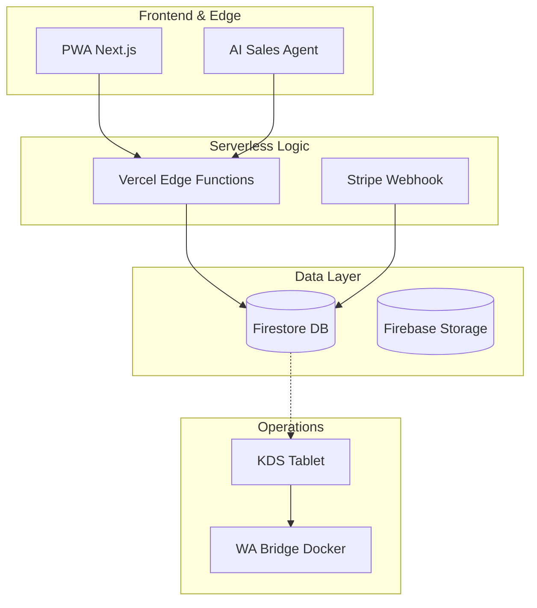

---

## 2. Modelo de Datos Normalizado (v2.0)

### Descripción del Modelo

Para garantizar la integridad y escalabilidad de **Masa & Cuchara**, el modelo de datos se ha desacoplado en cuatro niveles de persistencia que separan la configuración estática de la operativa en tiempo real:

1.  **Capa Maestra (CATALOG):** Es el inventario de productos que potencialmente se pueden elaborar. Define precios base, categorías y el esquema de modificadores permitidos (ingredientes extra, cambios, etc.). Es la fuente de verdad para la carta.
2.  **Capa de Configuración (SETTINGS):** Almacena las reglas de negocio globales, como el número máximo de pedidos permitidos por cada slot de 15 minutos y la definición del horario de servicio.
3.  **Capa Operativa (DAILY_OPERATION):** Es el documento crítico del sistema. Se genera uno por cada día de servicio (ID: YYYY-MM-DD). Contiene el stock real de productos para ese día y un mapa de ocupación de slots. Permite que el sistema realice reservas atómicas (restar comida y ocupar tiempo en una sola transacción).
4.  **Capa Transaccional (ORDERS):** Almacena el resultado final de la compra. Incluye el estado del pago (vía Stripe), los datos del cliente, el slot elegido y el desglose de productos con sus modificadores específicos.
5.  **Capa de Observabilidad (LOGS):** Colección inmutable que registra eventos críticos del sistema. Es fundamental para rastrear fallos en los Webhooks de Stripe, errores en el envío de mensajes de WhatsApp y auditoría de cambios manuales en el inventario.

### Diagrama de Entidad-Relación (ER)

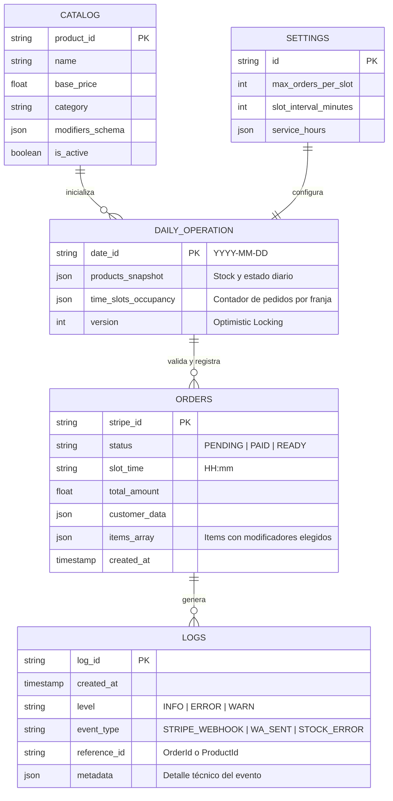

---

## 3. Diagrama de Secuencia Crítico (Pago y Notificación)

### Descripción del Flujo

Este diagrama detalla la interacción temporal entre los componentes del sistema para garantizar una venta segura y una notificación inmediata. El proceso es estrictamente síncrono en su fase de reserva:

1.  **Reserva Atómica:** Antes de enviar al cliente a Stripe, el sistema bloquea el stock y el slot temporal en Firestore (con un TTL de 15 min).
2.  **Autoridad del Webhook:** El estado del pedido solo cambia a "PAID" (Pagado) cuando Stripe confirma la transacción al servidor, nunca por acción directa del cliente.
3.  **Reactividad (Real-time):** El KDS recibe el pedido instantáneamente gracias a la escucha activa de la base de datos.
4.  **Notificación Asíncrona:** El aviso de WhatsApp se dispara automáticamente mediante una función de servidor al detectar el cambio de estado a "READY" en la cocina.

### Detalle del Diagrama de Secuencia

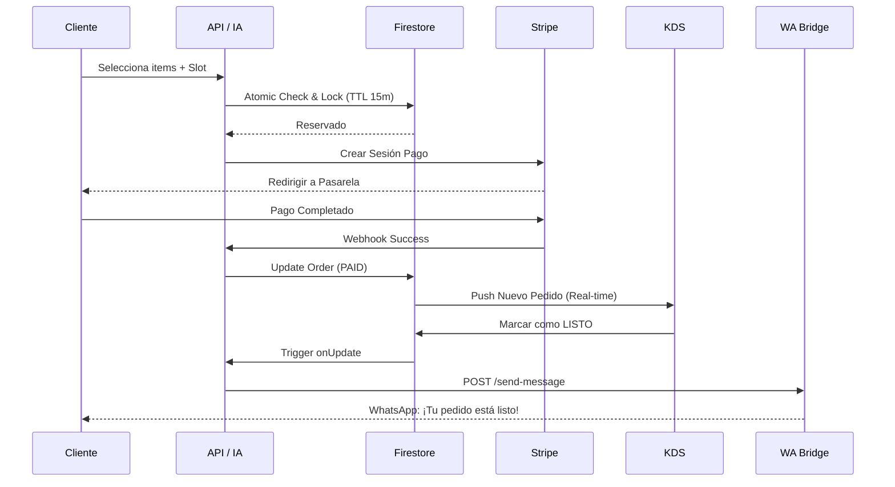

---

## 4. Lógica de Decisión del Agente IA

### Descripción del Flujo de Conversación

El Agente de IA actúa como un filtro inteligente entre el lenguaje natural del cliente y las funciones transaccionales del sistema. Su objetivo es minimizar la fricción y asegurar que el usuario siempre reciba información real basada en el stock del día antes de intentar un pago.

### Diagrama de Flujo (Lógica del Agente)

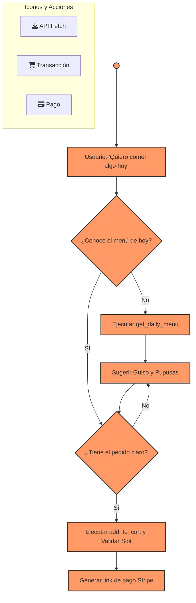

### Explicación de los Nodos Clave

| Nodo              | Función Técnica                                                   | Objetivo de Negocio                                       |
| :---------------- | :---------------------------------------------------------------- | :-------------------------------------------------------- |
| **DecisionStock** | Verifica si el contexto tiene los datos de `DAILY_OPERATION`.     | Evitar ofrecer productos agotados o fuera de carta.       |
| **Fetch**         | Llamada a la API para obtener el JSON de productos y stock.       | Sincronizar la IA con la realidad de la cocina.           |
| **Suggest**       | Motor de generación de texto basado en el catálogo.               | Realizar venta sugestiva (Upselling) de guisos y pupusas. |
| **DecisionReady** | Análisis de intención para verificar si el carrito está completo. | Asegurar que no falten datos críticos antes de pagar.     |
| **PreCheckout**   | Bloqueo de stock y validación de slots de 15 min.                 | Garantizar la reserva antes de ir a la pasarela de pago.  |
| **RedirectPay**   | Generación del enlace de pago mediante la API de Stripe.          | Cerrar la transacción de forma segura y profesional.      |

---

---

## 5. Esquema de Seguridad (Firestore Rules)

### Descripción de la Seguridad

La integridad de los datos en **Masa & Cuchara** se garantiza mediante el motor de reglas de Firestore. Se aplica el principio de "Confianza Cero" (Zero Trust), donde cada petición es validada en el servidor antes de ser ejecutada. La lógica de seguridad se divide en tres niveles de acceso:

1.  **Acceso Público Restringido:** El catálogo y el inventario diario son legibles por cualquier usuario para permitir la navegación, pero solo el sistema o el administrador pueden modificarlos.
2.  **Privacidad del Cliente:** Los pedidos (`orders`) están blindados. Un cliente solo puede acceder a sus propios documentos comparando su número de teléfono autenticado con el campo `customer.phone` del pedido.
3.  **Operaciones del Sistema:** Los cambios críticos (como marcar un pedido como pagado o restar stock) se realizan exclusivamente a través de Cloud Functions con privilegios de administrador, bloqueando cualquier intento de edición directa desde la PWA.

### Visualización del Control de Acceso

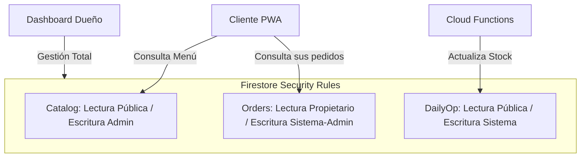

### Tabla de Permisos por Colección

| Colección          | Lectura (Read) | Escritura (Write) | Condición de Seguridad / Lógica                                                                                                 |
| :----------------- | :------------- | :---------------- | :------------------------------------------------------------------------------------------------------------------------------ |
| **Catalog**        | ✅ Público     | ❌ Solo Admin     | Solo el administrador puede modificar el menú maestro y precios.                                                                |
| **DailyOperation** | ✅ Público     | ❌ Solo Sistema   | El stock y los slots se descuentan mediante lógica de servidor tras el pago.                                                    |
| **Orders**         | 👤 Propietario | ❌ Solo Sistema   | El cliente solo accede si su `auth.phone` coincide con el del pedido.                                                           |
| **Settings**       | ✅ Público     | ❌ Solo Admin     | Protege la configuración global de la tienda (horarios y capacidad).                                                            |
| **Logs**           | ❌ Nadie       | ❌ Solo Sistema   | Registro de auditoría para depuración de errores y transacciones. Registro inmutable; solo las Cloud Functions pueden escribir. |

---

---

## 6. Ciclo de Vida y Estados del Pedido

### Descripción de la Máquina de Estados

Para asegurar una operativa de cocina fluida y evitar errores en la entrega, cada pedido gestionado por **Masa & Cuchara** sigue una máquina de estados lineal. El sistema utiliza el campo `status` en Firestore como activador (trigger) para las interfaces y servicios automáticos.

### Diagrama de Estados (State Diagram)

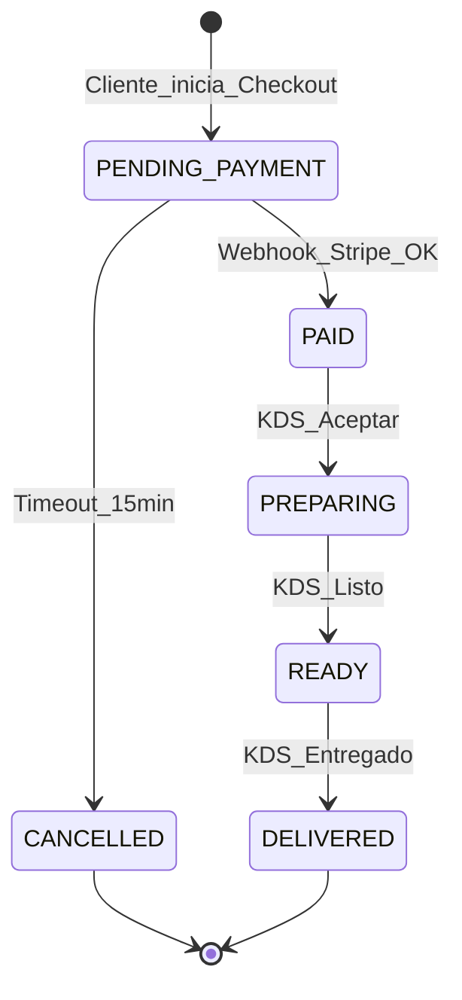

### Detalle de las Transiciones de Estado

| Estado Actual       | Acción / Evento          | Estado Siguiente    | Acción Automática (Side Effect)                   |
| :------------------ | :----------------------- | :------------------ | :------------------------------------------------ |
| **None**            | `create_order`           | **PENDING_PAYMENT** | Bloqueo de stock y reserva de slot (TTL 15m).     |
| **PENDING_PAYMENT** | `stripe_webhook_success` | **PAID**            | Confirmación definitiva de inventario.            |
| **PAID**            | `kds_accept`             | **PREPARING**       | El ticket cambia a "En preparación" en la tablet. |
| **PREPARING**       | `kds_ready`              | **READY**           | **Disparo de WA-Bridge: Mensaje de "Listo"**.     |
| **READY**           | `kds_delivered`          | **DELIVERED**       | Cierre del pedido y registro de métricas.         |
| **PENDING_PAYMENT** | `timeout_15m`            | **CANCELLED**       | Liberación automática de stock y slot.            |

## 7. Módulo de Administración (Dashboard del Propietario)

### Descripción del Dashboard

El Dashboard es el centro de control operativo de **Masa & Cuchara**. A diferencia de la PWA del cliente, esta interfaz gestiona la "entrada" de la arquitectura, permitiendo que el propietario defina qué se vende y bajo qué reglas. Es una aplicación protegida con privilegios de administrador que interactúa directamente con el catálogo maestro y la configuración de slots.

### Diagrama de Flujo: Gestión y Configuración Diaria

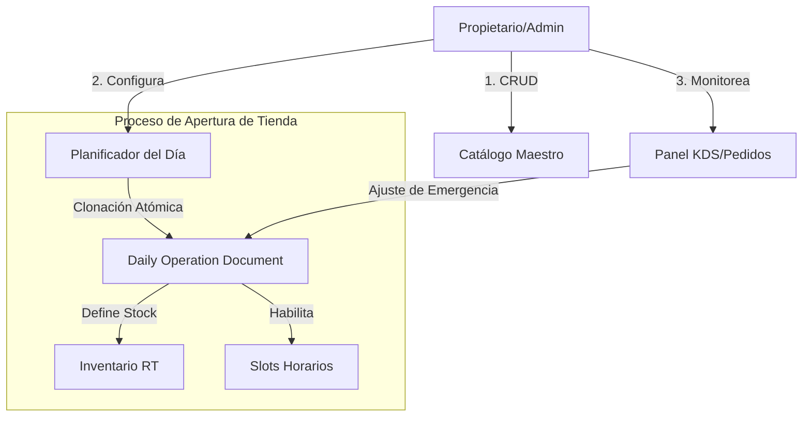

### 7.1. Actualización del Esquema: Panel de Control de Cierre (Dashboard)

El Dashboard integra ahora una capa de **Gestión de Liquidación Diaria** que permite al propietario supervisar la salud financiera de la jornada antes de ejecutar el bloqueo de datos.

#### Componentes de la Interfaz de Cierre:

1. **Monitor de Estados Críticos:** Widget que lista pedidos en `PREPARING` o `READY` que impiden el cierre legal de la caja.
2. **Consola de Conciliación:** Comparativa en tiempo real entre el "Saldo en Base de Datos" vs "Saldo en Stripe (Pendiente de cobro)".
3. **Trigger de Liquidación:** Botón de acción protegida (requiere doble confirmación) para disparar la Cloud Function de `Settlement`.

### 7.1.2. Tabla de Interfaz de Usuario (Módulo Administrativo)

| Elemento UI                | Función Técnica                                                      | Fuente de Datos                   |
| :------------------------- | :------------------------------------------------------------------- | :-------------------------------- |
| **Status de Jornada**      | Indicador Visual: `OPEN` / `CLOSING` / `CLOSED`.                     | `DAILY_OPERATION.is_closed`       |
| **Sumario Pre-Cierre**     | Cálculo al vuelo de ventas, propinas e impuestos.                    | `CollectionGroup(ORDERS)`         |
| **Acciones de Resolución** | Botones para "Forzar Cancelación" o "Marcar como Entregado" en lote. | `update_order_status` API         |
| **Visor de Discrepancias** | Alerta si `DB_total != Stripe_total`.                                | `Stripe_API_Balance` vs Firestore |

### 7.1.3. Justificación Técnica: El Dashboard como Orquestador

Al centralizar el cierre en el Dashboard, dotamos al propietario de una herramienta de **Auditoría Preventiva**. El sistema no solo informa, sino que impide que se cometan errores contables (como cerrar el día con dinero sin conciliar), delegando la lógica pesada de agregación a las Cloud Functions pero manteniendo el control final en manos humanas.

---

## 7.2. Diagrama de Flujo: Gestión y Configuración Diaria (Ciclo Completo)

Este diagrama es el corazón lógico del Dashboard. Define cómo el propietario interactúa con el sistema desde la apertura hasta el bloqueo contable final.

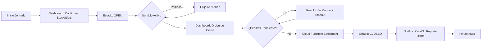

---

### 7.2.1. Tabla de Lógica de Transición Operativa (Dashboard)

Esta tabla detalla los puntos de control administrativo que el propietario gestiona a lo que largo del día. Define la interacción entre la interfaz de usuario (UI) y los estados del motor de reservas.

| Fase                 | Acción en Dashboard | Requisito de Validación                                      | Estado del Sistema | Resultado Técnico                                                  |
| :------------------- | :------------------ | :----------------------------------------------------------- | :----------------- | :----------------------------------------------------------------- |
| **1. Apertura**      | `Initialize Day`    | Carga de stock y slots en `DAILY_OPERATION`.                 | **OPEN**           | Habilita a la IA para comenzar la toma de pedidos.                 |
| **2. Monitoreo**     | `Order Management`  | Supervisión de pedidos en estados `PAID` / `READY`.          | **ACTIVE**         | Control visual del flujo de trabajo en cocina.                     |
| **3. Restricción**   | `Trigger Cutoff`    | Puede ser manual o automático según la hora configurada.     | **CUTOFF**         | La IA deja de ofrecer slots para el día en curso.                  |
| **4. Pre-Cierre**    | `Audit Pending`     | Verificación de que no hay órdenes en `PREPARING` o `READY`. | **VALIDATING**     | Bloqueo preventivo de la función de cierre si hay deuda operativa. |
| **5. Consolidación** | `Run Settlement`    | Ejecución de la Cloud Function de conciliación financiera.   | **SETTLING**       | Cruce de datos con Stripe y generación de reporte.                 |
| **6. Cierre**        | `Finalize Day`      | Escritura exitosa en la colección `SETTLEMENTS`.             | **CLOSED**         | Bloqueo de edición de la jornada (Read-Only).                      |

[Image of a state transition diagram for business operations management]

---

### 7.2.2. Análisis de Decisiones de Arquitectura (Control Administrativo)

Este análisis justifica la implementación de estados intermedios en el Dashboard para garantizar una transición fluida entre la operación activa y el cierre contable.

| Concepto de Diseño                   | Justificación Técnica y Operativa                                                                      | Impacto en la Experiencia del Dueño                                                                             |
| :----------------------------------- | :----------------------------------------------------------------------------------------------------- | :-------------------------------------------------------------------------------------------------------------- |
| **Dualidad CUTOFF vs CLOSED**        | El estado `CUTOFF` desactiva la captación de pedidos (IA) pero mantiene activa la gestión de entregas. | Permite al personal terminar el servicio sin la presión de nuevas entradas de última hora.                      |
| **Estado de Auditoría (Fase 4)**     | Actúa como un "Check de Vuelo" antes del aterrizaje (Cierre).                                          | Evita frustración al intentar cerrar la caja; el sistema indica proactivamente qué pedidos bloquean el proceso. |
| **Semáforo de Alerta (IDs en Rojo)** | Visualización por excepción de pedidos con estados inconsistentes.                                     | Reduce el tiempo de búsqueda manual; el dueño sabe exactamente dónde intervenir para liberar la jornada.        |

#### Notas de Implementación para Ricardo:

1. **Persistencia del Estado `CUTOFF`:** Este estado debe quedar registrado en el documento de `DAILY_OPERATION`. Si la Cloud Function de la IA detecta este flag, debe responder automáticamente con el código de error `CUTOFF_EXCEEDED` definido en la sección 11.6.4.
2. **Lógica de la Fase de Auditoría:** El Dashboard debe ejecutar una consulta reactiva (`onSnapshot`) sobre la colección de órdenes. Si el contador de pedidos en estados intermedios es `> 0`, el botón de "Ejecutar Cierre" debe permanecer deshabilitado (`disabled: true`).
3. **Archivo de Datos:** El paso a `CLOSED` es irreversible. Se recomienda que, tras el cierre, el Dashboard redirija automáticamente al propietario a la pantalla de "Resumen de Liquidación" para confirmar que el proceso terminó con éxito.

---

## 7.3. Interfaz de Resumen de Liquidación (Post-Cierre)

Una vez ejecutado el cierre, el Dashboard presenta este informe final. Este documento es inmutable y sirve como base para la contabilidad mensual.

### 7.3.1. Estructura del Informe de Liquidación

| Bloque Informativo          | Datos Incluidos                                         | Origen de los Datos              |
| :-------------------------- | :------------------------------------------------------ | :------------------------------- |
| **KPIs de Venta**           | Total Bruto, Total Neto (sin comisiones), Ticket Medio. | `SETTLEMENTS.kpis`               |
| **Mix de Productos**        | Top 5 platos más vendidos y productos agotados.         | `SETTLEMENTS.product_breakdown`  |
| **Conciliación Financiera** | Comparativa DB vs Stripe y registro de discrepancias.   | `SETTLEMENTS.reconciliation_log` |
| **Métricas Operativas**     | Tiempo medio de preparación y ocupación de slots.       | `SETTLEMENTS.ops_metrics`        |

### 7.3.2. Tabla de Lógica: Generación del Reporte (Backend)

| Paso  | Acción                    | Descripción Técnica                                                                   |
| :---- | :------------------------ | :------------------------------------------------------------------------------------ |
| **1** | **Cálculo de Comisiones** | Resta automática de la comisión de Stripe (1.5% + 0.25€ aprox.) al total bruto.       |
| **2** | **Cálculo de Mermas**     | Sumatoria del coste de productos en órdenes `CANCELLED` post-preparación.             |
| **3** | **Exportación PDF**       | Generación de un buffer de impresión para que el dueño guarde el reporte físicamente. |
| **4** | **Cierre de Ciclo**       | Envío de copia resumida al canal de WhatsApp del Administrador.                       |

### 7.3.3. Análisis para Ricardo:

- **Transparencia en Comisiones:** Es vital que el dueño vea el dinero "Limpio" (Neto) que llegará a su cuenta bancaria. Esto evita confusiones al revisar el extracto de Stripe días después.
- **El Valor de las Mermas:** Registrar por qué se cancelaron pedidos (ej. "Cliente no se presentó") ayuda a ajustar el stock y los precios en el futuro.
- **Acceso Histórico:** Aunque el día esté cerrado, el Dashboard permite navegar por un calendario para re-visualizar cualquier liquidación pasada mediante el ID `YYYY-MM-DD`.

---

## 8. Detalle Técnico de Funciones Administrativas

### Descripción de Operaciones de Entrada

Este apartado define la lógica de control del propietario sobre el sistema. Cada acción administrativa garantiza que la base de datos refleje la realidad física de la cocina, permitiendo que tanto la PWA como el Agente IA operen con datos veraces. La seguridad de estas operaciones está delegada en las reglas de Firestore (Sección 5) mediante la verificación del rol `admin`.

### Tabla de Operaciones de Administración

| Acción              | Componente           | Impacto en Base de Datos     | Lógica de Negocio                                                    |
| :------------------ | :------------------- | :--------------------------- | :------------------------------------------------------------------- |
| **Alta/Baja Plato** | Editor de Catálogo   | `CATALOG` (Write)            | Gestión de productos maestros, fotos, alérgenos y precios base.      |
| **Apertura de Día** | Planificador Diario  | `DAILY_OPERATION` (Create)   | Clonación del catálogo activo para generar la oferta del día actual. |
| **Ajustar Stock**   | Inventario Real-Time | `DAILY_OP.products` (Update) | Modificación manual de existencias en caso de mermas o agotamiento.  |
| **Cierre de Slot**  | Gestor de Horarios   | `SETTINGS` / `DAILY_OP`      | Bloqueo preventivo de franjas horarias por saturación de cocina.     |
| **Auditoría**       | Visor de Logs        | `LOGS` (Read)                | Consulta de eventos críticos (fallos en pagos o envíos de WhatsApp). |

### Diagrama de Secuencia: Inicialización de Jornada

Muestra el flujo técnico necesario para habilitar la venta cada mañana.

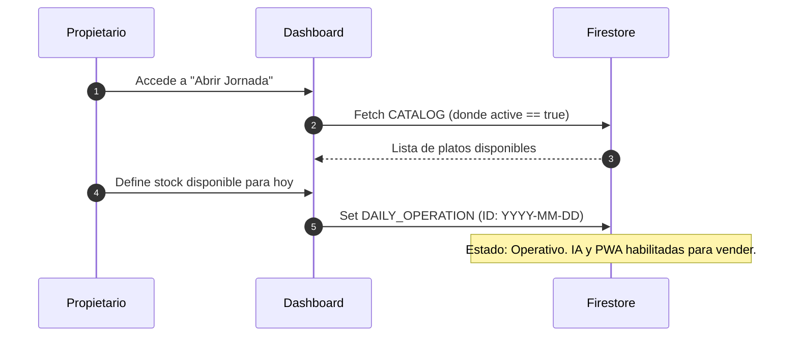

## 9. Módulo de Estadísticas y Análisis (BI)

### Descripción del Módulo Estadístico

Este componente permite al propietario transformar los datos transaccionales en información estratégica. A diferencia de los módulos operativos, el motor de estadísticas realiza consultas agregadas sobre el histórico de pedidos para identificar patrones de consumo, horas pico y rentabilidad por plato.

### Capacidades de Análisis

1.  **Ventas por Periodo:** Filtrado dinámico por día exacto o rangos de fechas (semanal, mensual, anual).
2.  **Ranking de Productos:** Identificación de los "Top Ventas" (ej: ¿Se venden más pupusas de queso o de chicharrón?).
3.  **Análisis de Ingresos:** Cálculo automático de ingresos brutos basados en el campo `total_amount` de los pedidos pagados.
4.  **Mapa de Calor de Slots:** Visualización de las franjas horarias con mayor volumen de pedidos para ajustar el personal de cocina.

### Tabla de Consultas Estadísticas

| Métrica              | Fuente de Datos | Filtros Aplicados                       | Resultado Visual                   |
| :------------------- | :-------------- | :-------------------------------------- | :--------------------------------- |
| **Ingresos Totales** | `ORDERS`        | `status: PAID/DELIVERED` + Rango Fechas | Kpi Numérico / Gráfico de Líneas   |
| **Mix de Ventas**    | `ORDERS.items`  | `status: PAID`                          | Gráfico de Tarta (Share por plato) |
| **Volumen por Hora** | `ORDERS.slot`   | `date: Range`                           | Histograma de barras (Horas Pico)  |
| **Ticket Medio**     | `ORDERS`        | `status: PAID`                          | Promedio de `total_amount`         |

### Diagrama de Flujo: Generación de Reporte

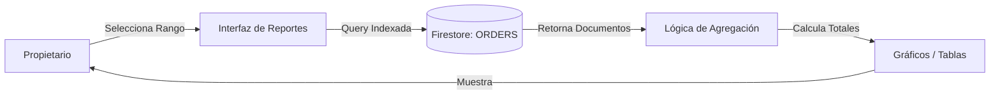

---

## 10. Notas Técnicas de Implementación

### Consideraciones de Infraestructura y Rendimiento

Para que la arquitectura descrita sea escalable y eficiente, el equipo de desarrollo debe tener en cuenta las siguientes directrices técnicas durante la fase de construcción:

### Tabla de Requerimientos Técnicos

| Categoría          | Requerimiento        | Justificación                                                                                        |
| :----------------- | :------------------- | :--------------------------------------------------------------------------------------------------- |
| **Base de Datos**  | Índices Compuestos   | Necesarios en Firestore para consultas de filtrado por `fecha` + `estado` en el módulo de BI.        |
| **Seguridad**      | Custom Claims        | Implementar roles de usuario en Firebase Auth para distinguir entre `admin` y `cliente`.             |
| **Rendimiento**    | Pre-Agregación       | Para volúmenes altos, pre-calcular estadísticas diarias mediante Cloud Functions programadas (CRON). |
| **Integración**    | Idempotencia Webhook | El endpoint de Stripe debe manejar reintentos para evitar duplicar pedidos en la base de datos.      |
| **Observabilidad** | TTL en Logs          | Configurar una política de borrado automático de logs antiguos (>90 días) para optimizar costes.     |

### Flujo de Despliegue (Pipeline)

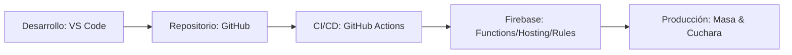

### Protocolo de Auditoría Financiera

> [!IMPORTANT] > **Nota Crítica de Seguridad y Finanzas:**
> Todas las funciones que impliquen manejo de dinero, tales como:
>
> - **Cierre de caja**
> - **Procesamiento de devoluciones**
> - **Cambios de precio en el catálogo**
>
> Deben quedar registradas **obligatoriamente** en la colección de `LOGS` con el nivel `WARN` (para cambios de precio/devoluciones) o `INFO` (para cierres de caja), incluyendo el ID del administrador que realizó la acción y el timestamp exacto.

---

### Justificación de las Notas Técnicas

La implementación de estas directrices no es opcional, sino crítica para la integridad del sistema bajo carga:

1. **Índices Compuestos:** Obligatorios para la resolución de predicados complejos en Firestore. Sin la definición explícita de índices que combinen `status` + `createdAt` + `total_amount`, el motor de consultas de Firebase lanzará excepciones en tiempo de ejecución al intentar generar los reportes del Apartado 9.
2. **Idempotencia:** Control de concurrencia y duplicidad. Es imperativo implementar una lógica de verificación de `stripe_event_id` en la Cloud Function del Webhook para evitar la duplicación de escrituras en la colección `ORDERS` ante reintentos de red (3xx/4xx/5xx).
3. **Pipeline (CI/CD):** Estandarización del ciclo de vida del software. El uso de GitHub Actions para el despliegue de Firebase Functions y Security Rules garantiza que solo el código que pase el linter y las pruebas unitarias llegue al entorno de producción, mitigando errores humanos en caliente.

---

## 11. Contratos de Interfaz (Esquemas JSON)

### 11.1. Esquema del Objeto Pedido (Order Entity)

Este esquema reside en la colección `ORDERS`. Es un documento crítico que debe mantener la integridad referencial con `DAILY_OPERATION`.

```json
{
  "order_id": "string (UUID / Stripe PaymentIntent ID)",
  "customer": {
    "uid": "string (Firebase Auth UID)",
    "phone": "string (E.164 format)",
    "display_name": "string"
  },
  "items": [
    {
      "product_id": "string (Ref a CATALOG)",
      "name": "string",
      "qty": "integer",
      "unit_price": "float",
      "subtotal": "float",
      "modifiers": [
        {
          "type": "string (ej: sabor_pupusa)",
          "value": "string"
        }
      ]
    }
  ],
  "logistics": {
    "slot_id": "string (format: HH:mm)",
    "order_date": "string (ISO 8601: YYYY-MM-DD)",
    "type": "string (PICKUP | DINE_IN)"
  },
  "payment": {
    "status": "string (PENDING | PAID | REFUNDED)",
    "stripe_session_id": "string",
    "total_amount": "float",
    "currency": "EUR"
  },
  "workflow": {
    "status": "string (PENDING_PAYMENT | PAID | PREPARING | READY | DELIVERED)",
    "created_at": "timestamp",
    "updated_at": "timestamp",
    "ready_at": "timestamp | null",
    "delivered_at": "timestamp | null"
  },
  "metadata": {
    "source": "string (PWA_IA | DASHBOARD)",
    "wa_notified": "boolean"
  }
}
```

### 11.2. Reglas de Validación de Datos (Business Rules)

Para garantizar la integridad del contrato definido en el esquema anterior, la capa de lógica (Cloud Functions) debe ejecutar las siguientes validaciones de forma obligatoria antes de persistir cualquier cambio en la base de datos:

| Campo                 | Regla de Validación (Server-side)                                           | Acción en caso de Error                         | Justificación Técnica                                                         |
| :-------------------- | :-------------------------------------------------------------------------- | :---------------------------------------------- | :---------------------------------------------------------------------------- |
| **`items`**           | Validación de SKU contra `DAILY_OPERATION` y comprobación de stock real.    | `400 Bad Request` / "Stock insuficiente"        | Evita la sobreventa por condiciones de carrera (Race Conditions).             |
| **`slot_id`**         | Verificación de disponibilidad de ventana temporal y capacidad de cocina.   | `409 Conflict` / "Slot saturado"                | Garantiza que el flujo de trabajo en cocina no exceda el límite operativo.    |
| **`total_amount`**    | Recálculo forzado en servidor (Suma de items != total enviado por cliente). | `400 Bad Request` / "Inconsistencia de precios" | Previene la manipulación de precios desde el cliente (Client-side tampering). |
| **`phone`**           | Validación sintáctica mediante Regex (estándar E.164).                      | `400 Bad Request` / "Formato inválido"          | Asegura la entrega del mensaje vía WA-Bridge.                                 |
| **`workflow.status`** | Validación de transición de estado permitida (ver Sección 6).               | `403 Forbidden` / "Transición no válida"        | Impide saltos lógicos (ej: de PENDING a READY sin pasar por PAID).            |

---

---

## 11.3. Mapeo de Persistencia y Análisis de Integridad Técnica

### Mapeo de Transformación: JSON a Firestore (ORDERS)

Este mapeo define cómo el objeto de transporte (JSON) se traduce a los campos definidos en la estructura de la base de datos para garantizar la eficiencia en las consultas y la integridad referencial.

| Campo en Firestore (DB) | Origen en JSON (Contrato)                | Tipo de Dato   | Lógica de Mapeo / Transformación                                |
| :---------------------- | :--------------------------------------- | :------------- | :-------------------------------------------------------------- |
| **`stripe_id` (PK)**    | `order_id` / `payment.stripe_session_id` | `string`       | Clave primaria del documento para asegurar idempotencia.        |
| **`status`**            | `workflow.status`                        | `string`       | Estado actual: `PENDING`, `PAID`, `READY`, `DELIVERED`.         |
| **`slot_time`**         | `logistics.slot_id`                      | `string`       | Extraído a raíz para indexación y filtrado rápido en KDS.       |
| **`total_amount`**      | `payment.total_amount`                   | `number`       | Valor monetario final validado por el servidor.                 |
| **`customer_data`**     | `customer`                               | `map / json`   | Objeto anidado con metadatos del cliente (UID, Phone).          |
| **`items_array`**       | `items`                                  | `array [maps]` | Snapshot de productos con sus modificadores y precios de venta. |
| **`created_at`**        | `workflow.created_at`                    | `timestamp`    | Marca temporal generada por el servidor (Server Timestamp).     |

### Análisis de Integridad Técnica

El diseño de este mapeo responde a tres pilares de robustez de nivel empresarial:

1. **Idempotencia por Designación de PK:** Al asignar el ID de la sesión o transacción de Stripe como la clave primaria (`PK`) del documento en Firestore, el sistema se vuelve inherentemente resistente a fallos de red. Cualquier intento de reenvío por parte del Webhook de Stripe resultará en una operación de escritura sobre el mismo documento, eliminando la duplicación de pedidos.
2. **Snapshot de Datos (Inmutabilidad Histórica):** El uso de `items_array` como un snapshot denormalizado protege la contabilidad del negocio. Los cambios de precio en el catálogo maestro no afectan a las órdenes ya procesadas, garantizando auditorías financieras coherentes.
3. **Eficiencia en Capa de Presentación (KDS):** La extracción de `slot_time` como campo de primer nivel evita escaneos de documentos completos. Esto permite que el Dashboard de cocina realice consultas indexadas de alto rendimiento, críticas durante las horas de máxima demanda.

---

## 11.4. Contrato de Webhook de Stripe (Payment Success)

### Descripción del Endpoint

El Webhook es el único punto de entrada autorizado para cambiar el estado de un pedido de `PENDING_PAYMENT` a `PAID`. Se implementa como una Cloud Function HTTPS configurada para recibir eventos `checkout.session.completed`.

### Esquema del Payload Recibido (Simplified)

Solo procesamos los campos estrictamente necesarios para la reconciliación del pedido:

```json
{
  "id": "evt_123...",
  "type": "checkout.session.completed",
  "data": {
    "object": {
      "id": "cs_test_...",
      "amount_total": 1550,
      "currency": "eur",
      "metadata": {
        "order_id": "ID_INTERNO_FIRESTORE",
        "customer_phone": "+34600000000"
      },
      "payment_status": "paid"
    }
  }
}
```

### Tabla de Lógica de Procesamiento (Webhook Handler)

Esta tabla define la secuencia de operaciones atómicas que la Cloud Function debe ejecutar al recibir una notificación de Stripe. El cumplimiento de este orden es crítico para la seguridad financiera del sistema.

| Paso  | Operación                  | Lógica Técnica / Validación                                                                   | Resultado Esperado                     |
| :---- | :------------------------- | :-------------------------------------------------------------------------------------------- | :------------------------------------- |
| **1** | **Verificación de Origen** | Validación de la firma `stripe-signature` mediante el SDK oficial y el _Secret_ del endpoint. | `200 OK` o `401 Unauthorized`          |
| **2** | **Filtrado de Evento**     | Discriminación del campo `type == "checkout.session.completed"`.                              | Ignorar otros eventos (Early Return).  |
| **3** | **Reconciliación**         | Extracción de `metadata.order_id` para localizar el documento en la colección `ORDERS`.       | Localización única de la orden.        |
| **4** | **Check de Idempotencia**  | Verificación del estado actual. Si `status == PAID`, no procesar de nuevo.                    | Evita duplicidad de tickets en cocina. |
| **5** | **Validación de Importe**  | Comparación de `data.object.amount_total` vs `ORDER.total_amount` en DB.                      | Prevención de discrepancias de pago.   |
| **6** | **Actualización Atómica**  | Cambio de estado a `PAID` y registro de `stripe_event_id` en la orden.                        | Orden confirmada y lista para cocina.  |

---

## 11.5. Protocolo de Cancelación Automática (Timeout TTL)

### Descripción del Proceso de Limpieza

Para garantizar la disponibilidad constante del inventario, el sistema debe liberar automáticamente los productos y slots reservados por pedidos que no completaron el pago en la ventana de tiempo establecida (15 minutos). Este proceso asegura que el "Stock Bloqueado" vuelva al "Stock Disponible".

### Diagrama de Flujo: Reversión de Inventario

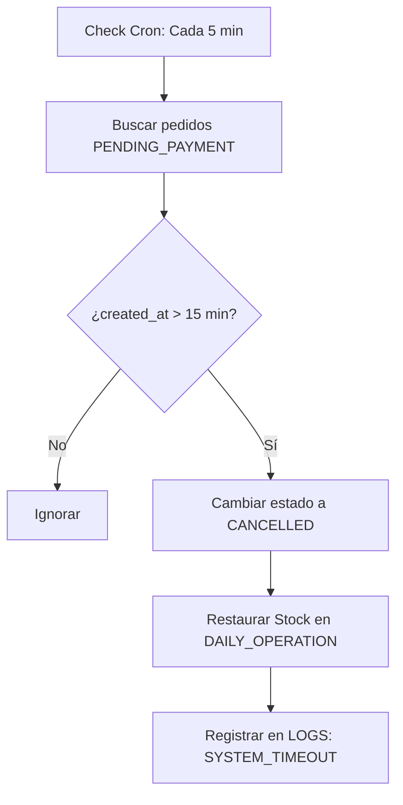

### Tabla de Lógica de Cancelación (Timeout Handler)

Esta tabla detalla las operaciones atómicas necesarias para la liberación de recursos. Cada paso debe ejecutarse dentro de una transacción única para evitar inconsistencias en el inventario.

| Paso  | Operación              | Lógica Técnica / Validación                                                                | Resultado Esperado                                       |
| :---- | :--------------------- | :----------------------------------------------------------------------------------------- | :------------------------------------------------------- |
| **1** | **Identificación**     | Query indexada en `ORDERS` donde `status == PENDING_PAYMENT` y `created_at < (now - 15m)`. | Obtención de punteros de documentos caducados.           |
| **2** | **Invalidación**       | Cambio de estado de la orden a `CANCELLED` mediante una operación de escritura atómica.    | Inhabilitación del pedido para futuras transacciones.    |
| **3** | **Reversión de Stock** | Incremento de unidades en `DAILY_OP.products` recorriendo el `items_array` de la orden.    | Restauración inmediata de la disponibilidad de platos.   |
| **4** | **Liberación de Slot** | Decremento del contador de ocupación en el nodo `time_slots_occupancy` de `DAILY_OP`.      | Apertura de disponibilidad horaria para nuevos clientes. |
| **5** | **Auditoría**          | Persistencia en la colección `LOGS` con `level: INFO` y `event_type: TIMEOUT_REVERSION`.   | Registro histórico de la liberación de recursos.         |

---

### 11.5.1. Análisis de Consistencia de Datos

El riesgo crítico en este flujo es la **Condición de Carrera (Race Condition)**. Existe una ventana de milisegundos donde el proceso de limpieza (Timeout) puede intentar cancelar un pedido en el mismo instante en que el Webhook de Stripe notifica un pago exitoso. Sin una estrategia de mitigación, el sistema podría marcar como cancelado un pedido ya pagado, generando una discrepancia financiera y operativa.

### Estrategia de Mitigación: Transaccionalidad Atómica

Para asegurar la integridad absoluta de los datos, el sistema implementará el siguiente protocolo de concurrencia:

| Mecanismo                     | Implementación Técnica                                                       | Objetivo                                                                                                                                             |
| :---------------------------- | :--------------------------------------------------------------------------- | :--------------------------------------------------------------------------------------------------------------------------------------------------- |
| **Transacción de Firestore**  | Uso de `runTransaction()` en la Cloud Function de limpieza.                  | Garantiza que la lectura del estado y la escritura de cancelación sean una operación indivisible.                                                    |
| **Bloqueo Optimista**         | Verificación de pre-condición: `status == PENDING_PAYMENT`.                  | Si el Webhook de Stripe escribió el estado `PAID` justo antes, la transacción de cancelación fallará automáticamente al detectar el cambio de datos. |
| **Prioridad de Commit**       | El Webhook de Stripe siempre tiene precedencia sobre el proceso de limpieza. | En caso de colisión, el sistema favorece la persistencia del pago y aborta la liberación de stock.                                                   |
| **Idempotencia de Reversión** | Registro del `stripe_session_id` en el documento de cancelación.             | Evita que el stock se incremente dos veces si el proceso de limpieza se reintenta por un fallo de ejecución.                                         |

> **Regla de Oro para el Desarrollador:** Bajo ninguna circunstancia se debe actualizar el stock en `DAILY_OPERATION` sin antes haber bloqueado el documento de la orden mediante una transacción exitosa en `ORDERS`.

---

### 11.5.2. Justificación Técnica: Control de Concurrencia

La estrategia de mitigación adoptada resuelve de manera determinista las condiciones de carrera mediante el uso de **Aislamiento de Transacciones**. Esta decisión de arquitectura se fundamenta en los siguientes principios:

| Principio                     | Justificación de Diseño                                                                                             | Impacto Operativo                                                                                                 |
| :---------------------------- | :------------------------------------------------------------------------------------------------------------------ | :---------------------------------------------------------------------------------------------------------------- |
| **Serialización de Estados**  | El uso de `runTransaction()` obliga al motor de la base de datos a encolar las peticiones sobre un mismo documento. | Elimina la posibilidad de estados "fantasma" donde una orden sea `PAID` y `CANCELLED` simultáneamente.            |
| **Integridad del Inventario** | La lógica de restauración de stock está encadenada al éxito de la invalidación del pedido.                          | Garantiza que el stock en `DAILY_OPERATION` siempre sea el reflejo fiel de las órdenes en estado activo.          |
| **Resiliencia ante Latencia** | El sistema asume que el Webhook de Stripe puede llegar con retraso.                                                 | Al dar prioridad al Webhook, protegemos la conversión de venta frente a procesos de mantenimiento automáticos.    |
| **Snapshot de Validación**    | La lectura previa dentro de la transacción actúa como un semáforo lógico.                                           | Si la pre-condición de estado no se cumple, el sistema aborta el proceso sin degradar la integridad de los datos. |

> **Nota para el Arquitecto:** Esta arquitectura garantiza consistencia fuerte (_Strong Consistency_) sobre la colección `ORDERS`, lo cual es imperativo dado que estamos gestionando transacciones financieras y recursos físicos limitados (comida).

---

## 11.6. Contrato de Función IA: add_to_cart (Payload & Response)

### Descripción de la Interfaz

Este contrato define la estructura de datos que el Agente IA debe generar cuando interpreta que el cliente desea realizar un pedido. La función actúa como un puente de validación previa antes de que el usuario proceda al checkout.

### Esquema del Payload de Salida (IA -> Backend)

La IA debe extraer y enviar los datos con la siguiente estructura JSON:

```json
{
  "action": "add_to_cart",
  "payload": {
    "items": [
      {
        "product_id": "string (mapeado del catálogo)",
        "quantity": "integer",
        "modifiers": [
          {
            "type": "string",
            "value": "string"
          }
        ]
      }
    ],
    "requested_slot": "string (formato HH:mm)",
    "customer_context": {
      "phone": "string",
      "session_id": "string"
    }
  }
}
```

### Tabla de Lógica de Respuesta (Backend -> Agente IA)

Esta tabla estipula el protocolo de comunicación que debe seguir el Backend para instruir a la IA sobre cómo proceder con la narrativa de venta, basándose en la disponibilidad real de recursos.

| Estado Respuesta | Código de Error (Slug) | Payload de Datos Adicional                 | Acción Requerida del Agente IA                                     |
| :--------------- | :--------------------- | :----------------------------------------- | :----------------------------------------------------------------- |
| **SUCCESS**      | `OK`                   | `{"total": float, "url": "stripe_link"}`   | Presenta el resumen del pedido y facilita el enlace de pago.       |
| **STOCK_ERROR**  | `OUT_OF_STOCK`         | `{"missing_item": "id", "available": int}` | Notifica la carencia y ofrece sustitutos o ajuste de cantidad.     |
| **SLOT_FULL**    | `SLOT_UNAVAILABLE`     | `{"alternatives": ["HH:mm", "HH:mm"]}`     | Gestiona la objeción proponiendo horarios de entrega viables.      |
| **VAL_ERROR**    | `MISSING_INFO`         | `{"required_field": "modifier_type"}`      | Ejecuta una pregunta de aclaración (ej: "Salsa picante o normal"). |
| **SYS_ERROR**    | `INTERNAL_FAIL`        | `{"message": "string"}`                    | Disculpa el error técnico y solicita reintentar en unos minutos.   |

### 11.6.2. Justificación Técnica: Desacoplamiento de la Narrativa

Al utilizar un sistema de **Códigos de Error (Slugs)** en lugar de mensajes de texto predefinidos, permitimos que el Backend se encargue exclusivamente de la lógica de negocio (Stock/Slots), mientras que el Agente IA mantiene la autonomía para generar una respuesta empática y natural acorde a la personalidad de la marca. Esto garantiza que la arquitectura sea robusta sin sacrificar la experiencia de usuario conversacional.

---

### 11.6.3. Validación de Horizonte Temporal (Booking Window)

Para asegurar la viabilidad de la producción, el sistema añade el campo `order_date` al contrato y aplica una restricción de "X" días (configurable en `DAILY_OPERATION`) respecto a la fecha actual.

### Actualización del Payload (IA -> Backend)

```json
{
  "action": "add_to_cart",
  "payload": {
    "items": [...],
    "requested_date": "string (YYYY-MM-DD)",
    "requested_slot": "string (HH:mm)"
  }
}
```

### Tabla de Lógica de Validación Temporal (IA/Backend)

Esta tabla define el protocolo de aceptación de pedidos en función de la ventana operativa permitida. El sistema debe denegar cualquier transacción que comprometa la capacidad de producción futura.

| Paso  | Validación                 | Lógica Técnica (Server-side)                                                       | Resultado / Error Code |
| :---- | :------------------------- | :--------------------------------------------------------------------------------- | :--------------------- |
| **1** | **Viabilidad de Fecha**    | `requested_date` ≥ `current_date` (ISO 8601).                                      | `DATE_PAST_ERROR`      |
| **2** | **Horizonte de Reserva**   | `requested_date` ≤ (`current_date` + `config.max_booking_days`).                   | `DATE_OUT_OF_RANGE`    |
| **3** | **Existencia de Jornada**  | Verificación de documento existente en `DAILY_OPERATION` para esa fecha.           | `JOURNAL_NOT_READY`    |
| **4** | **Hora de Corte (Cutoff)** | Si `date` == `today`, entonces `current_time` < `daily_config.cutoff_time`.        | `CUTOFF_EXCEEDED`      |
| **5** | **Validación de Slot**     | Comprobación de capacidad disponible en `time_slots_occupancy` para la fecha/hora. | `SLOT_UNAVAILABLE`     |

[Image of a reservation calendar logic and date validation sequence diagram]

### 11.6.4. Justificación Técnica: Protección de la Cadena de Suministro

1. **Blindaje contra la Incertidumbre:** Al restringir el horizonte de pedidos (ej. X = 3 días), el sistema protege al propietario de fluctuaciones en el precio de insumos y garantiza que el stock comprometido sea gestionable con la materia prima en almacén.
2. **Sincronización de Inventarios:** Cada `requested_date` apunta a un documento de stock independiente. Esto permite que el negocio ofrezca productos especiales (ej. "Plato del Domingo") sin que estos aparezcan disponibles para un pedido en martes.
3. **Manejo de Excepciones por la IA:** El código `DATE_OUT_OF_RANGE` permite que la IA responda con precisión: \*"Estamos aceptando pedidos solo hasta el próximo

### 11.6.5. Gestión de Excepciones: Pedidos Especiales (Eventos)

Para evitar que el horizonte estándar (X días) bloquee ventas de alto valor, se implementa una lógica de derivación o "Bypass":

| Tipo de Pedido      | Validación                                   | Acción del Sistema                                                           |
| :------------------ | :------------------------------------------- | :--------------------------------------------------------------------------- |
| **Estándar**        | Cumple `max_booking_days`.                   | Procesa vía Stripe automáticamente.                                          |
| **Especial/Evento** | Supera `max_booking_days` o volumen crítico. | La IA captura los datos y genera un `LEAD` en la colección `SPECIAL_ORDERS`. |

**Lógica Técnica:**
Si el cliente solicita una fecha `> max_booking_days`, la IA no responde con un error, sino que cambia el flujo: _"Para fechas tan lejanas, necesito que nuestro equipo revise la disponibilidad de cocina manualmente. ¿Te gustaría que les envíe tu solicitud?"_. Si el usuario acepta, se crea un documento para validación manual en el Dashboard.

### 11.6.6. Análisis de Decisiones de Arquitectura

Este apartado justifica las restricciones lógicas impuestas en el motor de reservas para alinear el software con la capacidad operativa real del negocio.

| Decisión de Diseño                            | Justificación Técnica y Operativa                                                                      | Beneficio para el Negocio                                                                                                                  |
| :-------------------------------------------- | :----------------------------------------------------------------------------------------------------- | :----------------------------------------------------------------------------------------------------------------------------------------- |
| **Implementación de `cutoff_time`**           | Lógica de bloqueo temporal que invalida pedidos para el mismo día tras una hora límite (ej: 11:00 AM). | Evita el colapso de cocina; aunque haya disponibilidad técnica en un slot de las 14:00, la capacidad de preparación física está protegida. |
| **Configuración Global (`max_booking_days`)** | Desacoplamiento de la variable de horizonte temporal de la lógica del código (Hard-coding).            | Permite a Ricardo o al propietario ajustar la ventana de ventas desde Firestore sin despliegues de código (Zero-downtime config).          |

#### Notas de Mantenimiento para el Sistema:

- **Prioridad del Cutoff:** La validación de la hora de corte tiene precedencia sobre la validación de stock. Si el reloj supera el `cutoff_time`, el sistema ni siquiera consulta la disponibilidad de platos para evitar latencias innecesarias.
- **Centralización en Firestore:** El campo `config.max_booking_days` debe residir en una colección de `SYSTEM_SETTINGS`. Esto garantiza que tanto el Dashboard como las Cloud Functions beban de la misma "fuente de verdad" (Single Source of Truth).

---

## 11.8. Protocolo de Cierre de Caja (Daily Settlement)

### 11.8.1. Esquema de Proceso: Flujo de Consolidación Diaria

Este diagrama representa la lógica de agregación y el paso de datos desde la capa operativa activa hacia la capa contable inmutable.

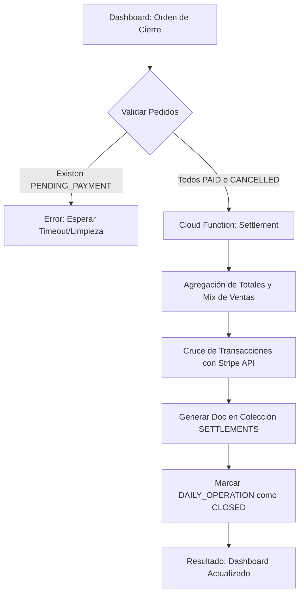

### 11.8.2. Descripción del Proceso

El **Cierre de Caja** es el protocolo de consolidación financiera que transfiere la responsabilidad de los datos desde la capa operativa hacia la capa de auditoría. Este proceso es mandatorio para garantizar que el historial de ingresos de **Masa & Cuchara** sea inmutable y veraz.

**Reglas de Negocio Aplicadas:**

- **Bloqueo de Transiciones:** El sistema impide el cierre si existen documentos en la colección `ORDERS` con estados no-finales (ej: `READY` o `PREPARING`).
- **Sincronización de Pasarela:** La Cloud Function de cierre actúa como un orquestador que consulta el balance real en la API de Stripe antes de generar el asiento contable.
- **Inmutabilidad Post-Cierre:** Al finalizar, el documento de la jornada en `DAILY_OPERATION` cambia su esquema a modo "Read-Only" mediante las reglas de seguridad del sistema.

### 11.8.3. Tabla de Lógica de Ejecución (Settlement Handler)

Esta tabla define la secuencia de operaciones que la Cloud Function debe realizar de forma atómica para asegurar que no existan fugas de información financiera.

| Paso  | Operación                  | Lógica Técnica / Validación                                                             | Resultado Esperado                        |
| :---- | :------------------------- | :-------------------------------------------------------------------------------------- | :---------------------------------------- |
| **1** | **Check de Integridad**    | Validación de que todos los pedidos del día están en `PAID`, `DELIVERED` o `CANCELLED`. | `Abort` si hay pedidos pendientes.        |
| **2** | **Agregación de Datos**    | Cálculo de `SUM(total_amount)`, conteo de platos por categoría y ticket medio.          | Generación del objeto `DailyKPIs`.        |
| **3** | **Conciliación Stripe**    | Llamada al endpoint `/v1/balance_transactions` filtrado por la fecha de la jornada.     | Validación de ingresos netos vs DB.       |
| **4** | **Snapshot Contable**      | Creación de un nuevo documento en la colección `SETTLEMENTS` con el ID `YYYY-MM-DD`.    | Registro inmutable de la jornada.         |
| **5** | **Bloqueo Operativo**      | Update de `DAILY_OPERATION` estableciendo el flag `is_closed: true`.                    | Cierre de la ventana de ventas y edición. |
| **6** | **Notificación de Cierre** | Disparo de evento al `WA-Bridge` informando al dueño del resumen financiero.            | Confirmación de fin de jornada.           |

---

### 11.8.4. Análisis de Decisiones de Arquitectura (Cierre de Caja)

Este análisis justifica las restricciones impuestas en el protocolo de cierre para garantizar la coherencia absoluta entre la actividad en cocina y la contabilidad del negocio.

| Factor de Diseño                      | Justificación Técnica y Operativa                                                                                            | Impacto en el Sistema                                                                                                     |
| :------------------------------------ | :--------------------------------------------------------------------------------------------------------------------------- | :------------------------------------------------------------------------------------------------------------------------ |
| **Sincronización Operativa (Paso 1)** | El bloqueo del cierre ante pedidos en estado `PREPARING` o `READY` fuerza la alineación entre la cocina y la administración. | Elimina el riesgo de "platos fantasma" que se cocinan pero no se contabilizan o cobran.                                   |
| **Indexación Semántica (Paso 4)**     | El uso de `YYYY-MM-DD` como clave primaria (PK) en la colección `SETTLEMENTS` permite el acceso directo a los datos.         | Optimiza el rendimiento del Módulo de BI (Sección 9) al evitar escaneos de colección; el acceso es por ID directo (O(1)). |
| **Validación de Capacidad**           | El cierre de jornada actúa como disparador para liberar cualquier recurso bloqueado en el motor de slots.                    | Asegura que el sistema esté limpio y listo para la inicialización de la siguiente jornada (Sección 8.2).                  |

[Image of a data indexing and semantic identification diagram in NoSQL databases]

#### Notas de Implementación para Ricardo:

1. **Protocolo de Bloqueo:** Si el Paso 1 falla, el Dashboard debe devolver una lista de IDs de pedidos conflictivos. Esto permite al dueño tomar una decisión: o los marca como `DELIVERED` (si ya se entregaron) o los cancela antes de reintentar el cierre.
2. **Consultas de Rango:** Aunque el ID sea la fecha, se deben mantener los campos de día, mes y año de forma independiente en el documento para facilitar los filtros agregados (ej: "Ventas de todos los lunes") sin procesar strings de fechas.
3. **Consistencia Eventual:** El Cierre de Caja es el punto donde la "Consistencia Eventual" de Firestore se convierte en "Consistencia Fuerte" para el negocio, al consolidar y bloquear los datos.

---

## 12. Módulo de Notificaciones Automáticas (Outbound Flows)

### 12.1. Arquitectura de Disparo (Event-Driven)

El sistema utiliza **Cloud Function Triggers** que escuchan cambios en el campo **`status`** de la colección `ORDERS`. Cuando el estado cambia, el sistema busca la plantilla correspondiente y la envía vía WhatsApp.

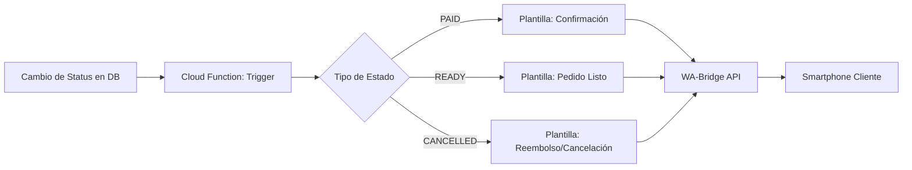

### 12.2. Matriz de Notificaciones y Plantillas

Esta tabla define el contenido y el disparador de cada comunicación enviada al cliente. Cada mensaje debe estar vinculado a un **`Template_ID`** pre-aprobado en el **WA-Bridge** para garantizar la entrega.

| Evento (**`status`**) | Plantilla de Mensaje (Ejemplo)                                                                                | Objetivo Operativo                             |
| :-------------------- | :------------------------------------------------------------------------------------------------------------ | :--------------------------------------------- |
| **`PAID`**            | "¡Pago confirmado! 🌮 Tu pedido **`#ID`** está agendado para el **`order_date`** a las **`requested_slot`**." | Confirmación de transacción y reserva.         |
| **`PREPARING`**       | "¡Buenas noticias! 👨‍🍳 Tu pedido ha entrado en cocina y se está preparando ahora mismo."                       | Reducción de la ansiedad de espera.            |
| **`READY`**           | "¡Listo para disfrutar! 🚀 Tu pedido ya está en el mostrador. Te esperamos para la recogida."                 | Activación del flujo de Pick-up.               |
| **`CANCELLED`**       | "Pedido cancelado. ⚠️ Hemos gestionado la devolución de tu pago. Info: **`cancel_reason`**."                  | Notificación de cierre por error o timeout.    |
| **`DELIVERED`**       | "¡Gracias por elegirnos! ❤️ Esperamos que disfrutes tu comida. ¡Hasta la próxima!"                            | Cierre de experiencia de usuario (Post-venta). |

### 12.3. Lógica de Implementación: El Worker de Notificaciones

El **Worker** es una Cloud Function de tipo **`onUpdate`** que actúa como un despachador inteligente. Su función es transformar eventos de base de datos en comunicaciones salientes.

| Paso  | Operación             | Lógica Técnica / Validación                                               | Resultado Esperado                            |
| :---- | :-------------------- | :------------------------------------------------------------------------ | :-------------------------------------------- |
| **1** | **Filtro de Cambio**  | Comparación de **`before.status`** vs **`after.status`**.                 | Evitar re-envíos por cambios en otros campos. |
| **2** | **Carga de Contexto** | Extracción de **`customer_phone`**, **`customer_name`** y **`order_id`**. | Datos necesarios para la personalización.     |
| **3** | **Selección de Meta** | Mapeo del nuevo **`status`** con el **`Template_ID`** correspondiente.    | Selección del mensaje adecuado al estado.     |
| **4** | **Despacho API**      | Llamada **`POST`** asíncrona hacia el endpoint del **WA-Bridge**.         | Envío del mensaje al terminal del cliente.    |
| **5** | **Registro / Ack**    | Escritura en el array **`notifications_log`** dentro del pedido.          | Historial de contacto para soporte técnico.   |

---

### 12.4. Análisis de Decisiones de Arquitectura (Notificaciones Outbound)

Este análisis detalla las consideraciones técnicas aplicadas para garantizar un sistema de comunicación eficiente, económico y transparente.

| Factor de Diseño                   | Justificación Técnica y Operativa                                                                                                | Impacto en el Negocio                                                                                                        |
| :--------------------------------- | :------------------------------------------------------------------------------------------------------------------------------- | :--------------------------------------------------------------------------------------------------------------------------- |
| **Filtro de Estado (Paso 1)**      | La lógica de comparación **`before.status`** vs **`after.status`** garantiza que el trigger solo se active ante cambios de fase. | **Optimización de Costes:** Evita el consumo accidental de créditos de WhatsApp por actualizaciones menores en el documento. |
| **Registro de Auditoría (Paso 5)** | Implementación del campo **`notifications_log`** como un histórico de eventos de mensajería dentro de cada orden.                | **Trazabilidad Total:** Permite al dueño verificar en el Dashboard la hora exacta de envío ante reclamaciones de clientes.   |
| **Inyección de Variables**         | Uso de placeholders dinámicos (como **`requested_slot`** y **`customer_name`**) en las plantillas de Meta.                       | **Personalización Dinámica:** Mejora la percepción de marca y la confianza del cliente en la automatización.                 |

[Image of a message delivery status flow for WhatsApp Business API with double checkmarks]

#### Notas de Implementación para Ricardo:

1. **Gobernanza de Costes:** Dado que cada mensaje saliente tiene un coste por conversación, el **Worker** debe estar programado para abortar el envío si el campo **`status`** vuelve a un estado previo (ej. un error manual que mueva de `READY` a `PREPARING`).
2. **Resiliencia de Red:** La llamada al **WA-Bridge** debe incluir una política de reintentos (Retry Policy) en caso de que el servicio de mensajería esté saturado, para asegurar que el aviso de **`READY`** llegue siempre al cliente.
3. **Privacidad de Datos:** El **`notifications_log`** solo debe almacenar el ID de la plantilla y el timestamp del envío; nunca debe persistir el contenido sensible del mensaje fuera de la colección de auditoría.

---

## 13. Seguridad y Roles de Usuario (RBAC)

### 13.1. Definición de Roles y Permisos

El sistema utiliza un modelo de **Control de Acceso Basado en Roles (RBAC)** para asegurar que cada actor solo acceda a la información estrictamente necesaria para su función.

| Rol             | Descripción                     | Permisos Clave                                                                   |
| :-------------- | :------------------------------ | :------------------------------------------------------------------------------- |
| **`admin`**     | Propietario / Gerente.          | Acceso total, cierre de caja, edición de stock y visualización de BI.            |
| **`staff`**     | Personal de cocina / mostrador. | Cambio de estados de pedido (**`PREPARING`**, **`READY`**), lectura de comandas. |
| **`system_ia`** | Service Account del Agente IA.  | Creación de pedidos y consulta de disponibilidad de stock/slots.                 |
| **`customer`**  | Cliente final (Anónimo/Auth).   | Solo lectura de sus propios pedidos y escritura inicial del carrito.             |

### 13.2. Implementación de Security Rules (Firestore)

Las reglas de seguridad son la última línea de defensa. Se aplican a nivel de documento para impedir accesos no autorizados desde el cliente.

| Colección             | Regla de Acceso | Lógica Técnica (**`match`**)                                           |
| :-------------------- | :-------------- | :--------------------------------------------------------------------- |
| **`ORDERS`**          | **`read`**      | `request.auth.uid == resource.data.customer_id` OR `hasRole('admin')`. |
| **`DAILY_OPERATION`** | **`write`**     | Solo `hasRole('admin')`. El **`staff`** solo puede leer.               |
| **`SETTLEMENTS`**     | **`all`**       | Solo `hasRole('admin')`. Inmutable para el resto de roles.             |
| **`SYSTEM_SETTINGS`** | **`read`**      | Público para la IA; escritura restringida a **`admin`**.               |

### 13.3. Lógica de Validación de Tokens (JWT)

| Paso  | Operación          | Detalle Técnico                                                           |
| :---- | :----------------- | :------------------------------------------------------------------------ |
| **1** | **Autenticación**  | Uso de **Firebase Auth** para gestionar sesiones y Custom Claims.         |
| **2** | **Identificación** | Inyección del rol en el token JWT (**`admin: true`**, **`staff: true`**). |
| **3** | **Autorización**   | La base de datos valida el token en cada petición `get/list/write`.       |
| **4** | **Auditoría**      | Registro del **`uid`** que realiza cambios críticos (ej: reembolsos).     |

---

### 13.4. Análisis de Decisiones de Arquitectura (Seguridad y Privacidad)

Este análisis justifica las tecnologías de cifrado y autorización elegidas para proteger la integridad operativa de **Masa & Cuchara**.

| Estrategia de Seguridad  | Justificación Técnica                                                                                    | Impacto en el Sistema                                                                                                                                       |
| :----------------------- | :------------------------------------------------------------------------------------------------------- | :---------------------------------------------------------------------------------------------------------------------------------------------------------- |
| **Custom Claims (JWT)**  | Los roles (**`admin`**, **`staff`**) se inyectan directamente en el token de identidad de Firebase Auth. | **Eficiencia y Coste:** La base de datos valida permisos sin realizar lecturas adicionales a colecciones de "Usuarios" ($O(1)$).                            |
| **Service Account (IA)** | El agente de IA opera con un set de credenciales de servidor con permisos limitados (Scope restringido). | **Blindaje de Configuración:** Garantiza que el chatbot solo pueda crear órdenes, impidiendo cualquier alteración en `SYSTEM_SETTINGS` o `SETTLEMENTS`.     |
| **Auth Anónimo (MVP)**   | Asignación de un **`uid`** temporal al cliente sin requerir registro previo (Email/Password).            | **Optimización de Conversión:** El cliente puede rastrear su pedido mediante su ID único sin fricciones de registro, manteniendo la seguridad de sus datos. |

#### Notas de Implementación para Ricardo:

1. **Jerarquía de Permisos en `ORDERS`:** El **`staff`** tiene permiso de `update` restringido únicamente al campo **`status`**. No pueden modificar el `total_amount` ni los ítems del pedido, lo que previene fraudes internos.
2. **Ciclo de Vida del Usuario Anónimo:** Al ser un usuario temporal, el sistema debe limpiar o archivar estos perfiles en Firebase Auth periódicamente una vez que la orden pase a estado `CLOSED` para no saturar el panel de usuarios.
3. **Validación de `requested_date`:** Las **Security Rules** de Firestore también deben validar que un cliente no pueda intentar crear un pedido para una fecha bloqueada o en estado `CLOSED`, actuando como una segunda capa de seguridad tras la IA.

---

## 14. Módulo de Cocina (Kitchen Display System - KDS)

### 14.1. Filosofía de Interfaz: "Zero-Friction"

El personal de cocina opera con las manos ocupadas. Por ello, el KDS se diseña para tablets de alta visibilidad con botones de gran tamaño y un código de colores semántico para los estados de los pedidos.

### 14.2. Esquema de Flujo de Trabajo en Cocina

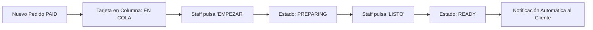

### 14.3. Tabla de Elementos de la Interfaz de Cocina (KDS)

El diseño de la interfaz para el personal de cocina prioriza la legibilidad a distancia y la interacción mínima. Cada elemento está pensado para ser operado en un entorno de alta presión.

| Componente UI             | Funcionalidad Técnica                                        | Comportamiento Visual                                 |
| :------------------------ | :----------------------------------------------------------- | :---------------------------------------------------- |
| **Header de Slot**        | Agrupa pedidos por **`requested_slot`** (ej: 14:00 - 14:15). | Color de fondo dinámico según proximidad horaria.     |
| **Tarjeta de Comanda**    | Muestra **`items`**, cantidades y **`special_notes`**.       | Tamaño de fuente aumentado para lectura a 2 metros.   |
| **Cronómetro de Cocción** | Cálculo de tiempo: `current_time` - **`status_updated_at`**. | Cambia a **Naranja** (15 min) y **Rojo** (>20 min).   |
| **Selector de Filtro**    | Permite ver solo **`PREPARING`** o ver el histórico del día. | Pestañas superiores de navegación rápida.             |
| **Action Button**         | Trigger para transicionar el **`status`** del pedido.        | Botón de ancho completo (Full-width) para uso táctil. |

### 14.4. Lógica de Sincronización en Tiempo Real

La eficiencia del **KDS** reside en su capacidad de actualizarse instantáneamente sin intervención humana, utilizando el patrón **Observer** sobre la base de datos.

| Paso  | Operación              | Lógica Técnica / Validación                                                   | Resultado Esperado                                              |
| :---- | :--------------------- | :---------------------------------------------------------------------------- | :-------------------------------------------------------------- |
| **1** | **Stream Activo**      | Suscripción mediante **`onSnapshot`** a la colección **`ORDERS`**.            | Actualización de la UI en <200ms tras un cambio.                |
| **2** | **Query de Jornada**   | Filtro por **`order_date`** == **`today`** y **`status`** != **`DELIVERED`**. | Solo se muestran pedidos pendientes o en curso.                 |
| **3** | **Sort por Prioridad** | Ordenación ascendente por **`requested_slot`** y luego por **`created_at`**.  | Los pedidos con entrega más próxima suben al inicio.            |
| **4** | **Mutación Atómica**   | Uso de **`updateDoc`** para cambiar el estado al siguiente nivel.             | Cambio inmediato de **`PAID`** ➔ **`PREPARING`** ➔ **`READY`**. |
| **5** | **Feedback Sonoro**    | Disparo de evento de audio al detectar un nuevo documento en el stream.       | Alerta al staff sin necesidad de mirar la pantalla.             |

---

### 14.5. Análisis de Decisiones de Arquitectura (Eficiencia en Cocina)

Este análisis detalla las reglas de visualización y sincronización diseñadas para optimizar el rendimiento del personal de cocina y reducir el desperdicio.

| Decisión de Diseño                    | Justificación Técnica y Operativa                                                                           | Impacto en la Operación                                                                                                                         |
| :------------------------------------ | :---------------------------------------------------------------------------------------------------------- | :---------------------------------------------------------------------------------------------------------------------------------------------- |
| **Priorización por `requested_slot`** | La ordenación primaria se realiza por la hora de entrega solicitada, no por la hora de creación del pedido. | **Eficiencia Logística:** Evita que pedidos futuros (pre-pedidos) bloqueen la visibilidad de los pedidos inmediatos.                            |
| **Sincronización `onSnapshot`**       | El KDS mantiene un túnel de datos bidireccional y constante con Firestore.                                  | **Reducción de Mermas:** Si un pedido se cancela en el Dashboard, la tarjeta desaparece de cocina al instante, evitando cocciones innecesarias. |
| **Auto-Limpieza de Interfaz**         | El filtro excluye automáticamente pedidos en estado **`DELIVERED`** o **`CANCELLED`**.                      | **Higiene Visual:** La pantalla solo muestra trabajo pendiente, eliminando distracciones y saturación de información.                           |

#### Notas de Implementación para Ricardo:

1. **Lógica del Sort Multicanal:** El algoritmo de ordenación debe ser: `1º requested_slot` (ASC) -> `2º created_at` (ASC). Esto garantiza que, dentro de un mismo tramo horario, se respete estrictamente el orden de llegada.
2. **Persistencia y Resiliencia:** Gracias al SDK de Firebase, si la tablet de cocina pierde conexión momentáneamente, la **Sincronización Silenciosa** recuperará el estado exacto en cuanto vuelva el Wi-Fi, disparando todas las notificaciones pendientes de golpe.
3. **Control de Flujo:** Al ocultar los pedidos **`DELIVERED`**, el sistema incentiva al staff a completar el ciclo de vida del pedido para mantener su espacio de trabajo despejado, lo que asegura que el cliente reciba su notificación de "Entregado/Gracias" puntualmente.

---

## 9. Módulo de Estadísticas y Business Intelligence (BI)

### 9.1. Arquitectura de Datos Analíticos

Para optimizar el rendimiento y minimizar costes de lectura, el motor de BI utiliza los documentos de **`SETTLEMENTS`** (agregados diarios) en lugar de procesar miles de documentos individuales de la colección **`ORDERS`**.

### 9.2. KPIs y Métricas de Rendimiento

El Dashboard de BI presenta cuatro ejes fundamentales para la toma de decisiones del propietario:

| Eje Analítico   | KPI Específico                                | Utilidad para el Negocio                        |
| :-------------- | :-------------------------------------------- | :---------------------------------------------- |
| **Ventas**      | Ingresos Brutos vs Netos, Ticket Medio.       | Evaluación de rentabilidad real y márgenes.     |
| **Popularidad** | Ranking de Platos (Top 5) y Guarniciones.     | Optimización de stock y diseño de carta.        |
| **Operativa**   | Tiempo medio de preparación (SLA) por franja. | Identificación de cuellos de botella en cocina. |
| **Demanda**     | Calor de Ventas por **`requested_slot`**.     | Ajuste de personal según horas punta.           |

### 9.3. Lógica de Consultas y Agregación

| Paso  | Operación           | Lógica Técnica                                                                     | Resultado Esperado                                  |
| :---- | :------------------ | :--------------------------------------------------------------------------------- | :-------------------------------------------------- |
| **1** | **Filtro Temporal** | Consulta por rango de IDs en **`SETTLEMENTS`** (ej: `2026-01-01` al `2026-01-31`). | Obtención del set de datos mensual.                 |
| **2** | **Agregación**      | Reducción de arrays de KPIs diarios en un objeto global de periodo.                | Consolidación de métricas mensuales/anuales.        |
| **3** | **Visualización**   | Mapeo de datos hacia librerías de gráficos (Charts.js / Recharts).                 | Representación visual de tendencias y comparativas. |
| **4** | **Exportación**     | Generación de reportes en formato CSV/PDF para asesoría.                           | Portabilidad de datos contables.                    |

---

### 9.2. KPIs y Métricas de Rendimiento (Dashboard BI)

El motor de **Business Intelligence** agrupa los datos en cuatro dimensiones críticas. Esta estructura permite al propietario pasar de una visión general a un análisis detallado de cada producto.

| Eje Analítico    | KPI Específico                   | Fuente de Datos (**`SETTLEMENTS`**) | Utilidad Estratégica                                           |
| :--------------- | :------------------------------- | :---------------------------------- | :------------------------------------------------------------- |
| **Rentabilidad** | **Ingresos Netos** (Post-Stripe) | **`total_net_amount`**              | Conocer el flujo de caja real que llega al banco.              |
| **Venta Media**  | **Ticket Medio por Pedido**      | **`total_bruto` / `order_count`**   | Evaluar la eficacia de promociones y upselling.                |
| **Popularidad**  | **Mix de Ventas (Top 5)**        | **`product_breakdown_array`**       | Decidir qué platos mantener o eliminar de la carta.            |
| **Eficiencia**   | **SLA de Cocina (Tiempo medio)** | **`avg_prep_time`**                 | Identificar si la cocina necesita más personal en horas punta. |

### 9.3. Lógica de Consultas y Agregación (Data Engine)

Esta tabla describe cómo el sistema procesa la información para evitar la saturación de la base de datos y mantener costes operativos bajos.

| Paso  | Operación                   | Lógica Técnica / Validación                                                 | Resultado Esperado                                            |
| :---- | :-------------------------- | :-------------------------------------------------------------------------- | :------------------------------------------------------------ |
| **1** | **Query de Periodo**        | Consulta por rango de IDs: `WHERE ID >= START_DATE AND ID <= END_DATE`.     | Obtención de los documentos diarios del mes/semana.           |
| **2** | **Reducción de Datos**      | Función **`reduce()`** para sumar totales y promediar tiempos de respuesta. | Consolidación de métricas en un único objeto de reporte.      |
| **3** | **Cruce de Inventario**     | Comparativa entre `stock_inicial` y `stock_vendido`.                        | Reporte de desviaciones o errores de inventario.              |
| **4** | **Renderizado de Gráficos** | Inyección de datos en la capa de UI (**`Charts.js`** o **`Recharts`**).     | Visualización de tendencias (líneas, barras, mapas de calor). |
| **5** | **Exportación**             | Generación de archivo **`.csv`** o **`.pdf`** firmado digitalmente.         | Documento listo para gestoría o archivo contable.             |

---

### 9.4. Análisis de Decisiones de Arquitectura (Business Intelligence)

Este análisis detalla cómo la estructura de datos elegida transforma la información operativa en una ventaja competitiva para el propietario de **Masa & Cuchara**.

| Factor de Diseño                  | Justificación Técnica y Operativa                                                    | Ventaja para el Propietario                                                                                                                                   |
| :-------------------------------- | :----------------------------------------------------------------------------------- | :------------------------------------------------------------------------------------------------------------------------------------------------------------ |
| **Acceso O(1) y O(n) Optimizado** | Uso de **`YYYY-MM-DD`** como clave primaria en la colección **`SETTLEMENTS`**.       | **Reducción de Costes:** Consultar un mes completo requiere solo 30 lecturas frente a las ~3,000 que exigiría procesar pedidos individuales (Ahorro del 99%). |
| **Matriz de "Platos Estrella"**   | Cruce de métricas de ventas brutas contra mermas y cancelaciones por falta de stock. | **Control de Proveedores:** Identifica si un plato estrella falla por roturas de stock recurrentes, permitiendo cambiar de proveedor o ajustar compras.       |
| **Heatmap de Capacidad (Slots)**  | Análisis de saturación de **`requested_slot`** por día de la semana.                 | **Optimización de Ingresos:** Permite aplicar "Precios Dinámicos" o reforzar la plantilla en franjas críticas de agotamiento rápido.                          |

#### Notas de Implementación para Ricardo:

1. **Eficiencia en la Nube:** Al delegar la agregación de datos a la Cloud Function de cierre de caja (Sección 11.8), el Dashboard de BI carga de forma casi instantánea, ya que los cálculos matemáticos pesados ya se realizaron y persistieron.
2. **Visualización Accionable:** Los gráficos no deben ser solo informativos. El sistema debe resaltar automáticamente en **Rojo** aquellos slots que llegan al 100% de ocupación antes de las 11:00 AM, sugiriendo al dueño que hay una demanda insatisfecha.
3. **Privacidad y Cumplimiento:** Los documentos de **`SETTLEMENTS`** contienen datos agregados y anónimos. Esto permite generar reportes contables y de rendimiento sin necesidad de exponer datos personales de los clientes, cumpliendo con las mejores prácticas de seguridad.

---
